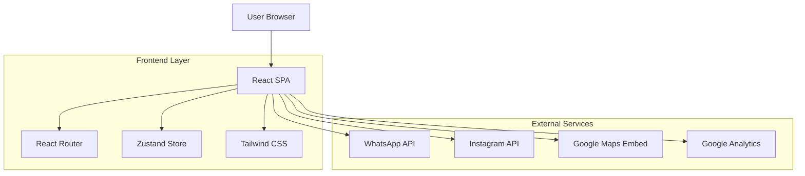

## 1. Arquitetura do Sistema



## 2. Stack Tecnológica

### Frontend
- **React 18.2+**: Framework principal com hooks e componentes funcionais
- **TypeScript 5+**: Type safety e melhor desenvolvimento
- **Vite 4+**: Build tool rápido com HMR instantâneo
- **Tailwind CSS 3+**: Framework CSS utility-first
- **Zustand 4+**: Gerenciamento de estado leve e eficiente
- **React Router DOM 6+**: Roteamento client-side
- **Framer Motion 10+**: Animações fluidas e performáticas

### Ferramentas de Desenvolvimento
- **ESLint**: Linting e qualidade de código
- **Prettier**: Formatação consistente
- **PostCSS**: Processamento CSS avançado
- **Autoprefixer**: Compatibilidade cross-browser

## 3. Estrutura do Projeto

```
src/
├── components/           # Componentes React
│   ├── common/          # Componentes reutilizáveis
│   │   ├── Button.tsx
│   │   ├── Card.tsx
│   │   ├── Section.tsx
│   │   └── Typography.tsx
│   ├── layout/          # Componentes de layout
│   │   ├── Header.tsx
│   │   ├── Footer.tsx
│   │   ├── Navigation.tsx
│   │   └── WhatsAppFloat.tsx
│   ├── sections/        # Seções da landing page
│   │   ├── Hero.tsx
│   │   ├── About.tsx
│   │   ├── Services.tsx
│   │   ├── Gallery.tsx
│   │   ├── Testimonials.tsx
│   │   └── Contact.tsx
│   └── ui/              # Componentes de UI específicos
│       ├── ServiceCard.tsx
│       ├── TestimonialCard.tsx
│       ├── InstagramFeed.tsx
│       └── GoogleMap.tsx
├── pages/               # Páginas completas
│   ├── Home.tsx
│   ├── About.tsx
│   ├── Services.tsx
│   ├── Gallery.tsx
│   └── Contact.tsx
├── hooks/               # Custom hooks
│   ├── useScroll.ts
│   ├── useIntersectionObserver.ts
│   └── useMediaQuery.ts
├── store/               # Estado global Zustand
│   ├── navigationStore.ts
│   └── uiStore.ts
├── utils/               # Funções utilitárias
│   ├── constants.ts
│   ├── helpers.ts
│   └── seo.ts
├── types/               # Definições TypeScript
│   ├── components.ts
│   └── api.ts
├── styles/              # Estilos globais
│   ├── globals.css
│   └── animations.css
└── assets/              # Assets estáticos
    ├── images/
    ├── icons/
    └── fonts/
```

## 4. Componentes Principais

### 4.1 Layout Components
- **Header**: Navegação fixa com scroll behavior e menu mobile
- **Footer**: Informações de contato, links rápidos e redes sociais
- **WhatsAppFloat**: Botão flutuante com link direto para WhatsApp
- **Section**: Wrapper padronizado para seções com padding consistente

### 4.2 Section Components
- **Hero**: Section inicial com foto do profissional, título e CTA
- **About**: Apresentação do studio e trajetória do profissional
- **Services**: Grid de cards com serviços oferecidos
- **Gallery**: Grid responsivo com integração Instagram
- **Testimonials**: Carrossel de depoimentos de clientes
- **Contact**: Formulário, mapa e informações de contato

### 4.3 UI Components
- **Button**: Componente reutilizável com variants (primary, secondary, outline)
- **Card**: Wrapper flexível para conteúdos com sombra e bordas
- **Typography**: Componentes de texto com estilos predefinidos
- **ServiceCard**: Card específico para serviços com ícone e descrição
- **TestimonialCard**: Card de depoimento com foto e quote

## 5. Sistema de Rotas

| Rota | Componente | Descrição |
|------|------------|-----------|
| `/` | Home | Landing page principal com todas as seções |
| `/sobre` | About | Página dedicada à história e valores |
| `/servicos` | Services | Lista detalhada de todos os serviços |
| `/galeria` | Gallery | Galeria completa de trabalhos |
| `/contato` | Contact | Página de contato com formulário e mapa |

### 5.1 Roteamento Interno (Scroll)
- Navegação por âncoras para seções na homepage
- Smooth scroll entre seções
- Highlight do item ativo no menu

## 6. Gerenciamento de Estado

### 6.1 Zustand Stores
```typescript
// navigationStore.ts
interface NavigationStore {
  isMenuOpen: boolean;
  activeSection: string;
  toggleMenu: () => void;
  setActiveSection: (section: string) => void;
}

// uiStore.ts
interface UIStore {
  isLoading: boolean;
  showWhatsApp: boolean;
  setLoading: (loading: boolean) => void;
  setShowWhatsApp: (show: boolean) => void;
}
```

### 6.2 Estado Local de Componentes
- Form states para formulários
- Carrossel states para navegação
- Loading states para API calls

## 7. Estilização e Temas

### 7.1 Configuração Tailwind
```javascript
// tailwind.config.js
module.exports = {
  content: ['./src/**/*.{js,jsx,ts,tsx}'],
  theme: {
    extend: {
      colors: {
        primary: {
          black: '#000000',
          white: '#FFFFFF',
        },
        neutral: {
          50: '#F5F5F5',
          100: '#E5E5E5',
          200: '#A0A0A0',
          800: '#404040',
        },
        accent: {
          gold: '#D4AF37',
          sepia: '#CD853F',
          magenta: '#FF00FF',
          magentaDark: '#C2185B',
        },
      },
      fontFamily: {
        elegant: ['Playfair Display', 'serif'],
        sans: ['Inter', 'sans-serif'],
      },
      animation: {
        fadeIn: 'fadeIn 0.5s ease-in-out',
        slideUp: 'slideUp 0.5s ease-out',
        scaleIn: 'scaleIn 0.3s ease-out',
      },
    },
  },
  plugins: [],
};
```

### 7.2 Sistema de Espaçamento
- Base consistente em múltiplos de 4px
- Grid system de 12 colunas
- Breakpoints mobile-first

## 8. Integrações Externas

### 8.1 WhatsApp Business API
```typescript
const WHATSAPP_CONFIG = {
  phoneNumber: '5585996163468',
  baseUrl: 'https://wa.me/',
  defaultMessage: 'Olá! Gostaria de agendar um horário.',
};

const generateWhatsAppLink = (service?: string): string => {
  const message = service 
    ? `Olá! Gostaria de agendar ${service}.`
    : WHATSAPP_CONFIG.defaultMessage;
  
  return `${WHATSAPP_CONFIG.baseUrl}${WHATSAPP_CONFIG.phoneNumber}?text=${encodeURIComponent(message)}`;
};
```

### 8.2 Instagram Basic Display API
```typescript
const INSTAGRAM_CONFIG = {
  accessToken: process.env.REACT_APP_INSTAGRAM_TOKEN,
  userId: process.env.REACT_APP_INSTAGRAM_USER_ID,
  fields: 'id,caption,media_type,media_url,permalink,timestamp',
  limit: 9,
};

const fetchInstagramFeed = async (): Promise<InstagramPost[]> => {
  const response = await fetch(
    `https://graph.instagram.com/${INSTAGRAM_CONFIG.userId}/media?fields=${INSTAGRAM_CONFIG.fields}&limit=${INSTAGRAM_CONFIG.limit}&access_token=${INSTAGRAM_CONFIG.accessToken}`
  );
  return response.json();
};
```

### 8.3 Google Maps Embed
```typescript
const GOOGLE_MAPS_CONFIG = {
  apiKey: process.env.REACT_APP_GOOGLE_MAPS_KEY,
  address: 'Rua Oliveira Sobrinho, Bonsucesso',
  coordinates: {
    lat: -3.71722,
    lng: -38.5434,
  },
  zoom: 15,
};
```

## 9. Otimizações de Performance

### 9.1 Code Splitting
```typescript
// Lazy loading de páginas
const About = lazy(() => import('./pages/About'));
const Services = lazy(() => import('./pages/Services'));
const Gallery = lazy(() => import('./pages/Gallery'));
const Contact = lazy(() => import('./pages/Contact'));

// Suspense wrapper
<Suspense fallback={<LoadingSpinner />}>
  <Routes>
    <Route path="/sobre" element={<About />} />
    <Route path="/servicos" element={<Services />} />
    <Route path="/galeria" element={<Gallery />} />
    <Route path="/contato" element={<Contact />} />
  </Routes>
</Suspense>
```

### 9.2 Image Optimization
- Uso de WebP format com fallback para JPEG/PNG
- Lazy loading nativo com `loading="lazy"`
- Responsive images com `srcset` e `sizes`
- Image CDN para otimização automática

### 9.3 Bundle Optimization
- Tree shaking para remover código não utilizado
- Minificação de CSS e JavaScript
- Gzip/Brotli compression no servidor
- HTTP/2 para multiplexação de requests

## 10. SEO e Meta Tags

### 10.1 Meta Tags Dinâmicas
```typescript
const SEO_CONFIG = {
  title: 'M Studio Dimmy - Beleza e Estética Premium',
  description: 'Realce sua beleza com Dimmy Marinho. Especialista em sobrancelhas, maquiagem e consultoria de imagem. Agende seu horário!',
  keywords: 'sobrancelha, maquiagem, design, beleza, estética, Dimmy Marinho',
  author: 'Dimmy Marinho',
  viewport: 'width=device-width, initial-scale=1.0',
  charset: 'UTF-8',
};

const generateMetaTags = (page: string): MetaTags => {
  return {
    title: `${page} | ${SEO_CONFIG.title}`,
    description: SEO_CONFIG.description,
    ogTitle: `${page} - M Studio Dimmy`,
    ogDescription: SEO_CONFIG.description,
    ogImage: '/og-image.jpg',
    ogUrl: `https://mstudiodimmy.com.br/${page.toLowerCase()}`,
  };
};
```

### 10.2 Schema Markup
```typescript
const LOCAL_BUSINESS_SCHEMA = {
  '@context': 'https://schema.org',
  '@type': 'LocalBusiness',
  name: 'M Studio Dimmy',
  description: 'Studio de beleza especializado em sobrancelhas e maquiagem',
  address: {
    '@type': 'PostalAddress',
    streetAddress: 'Rua Oliveira Sobrinho',
    addressLocality: 'Fortaleza',
    addressRegion: 'CE',
    postalCode: '60330-140',
  },
  telephone: '+55 85 99616-3468',
  openingHours: 'Mo-Fr 09:00-18:00',
  priceRange: '$$',
};
```

## 11. Testes e Qualidade

### 11.1 Testes Unitários
- Jest + React Testing Library
- Coverage mínimo de 80%
- Testes de componentes críticos

### 11.2 Testes de Integração
- Testes de formulários e validações
- Testes de navegação e rotas
- Testes de integrações externas (mock)

### 11.3 Testes de Performance
- Lighthouse CI para monitoramento contínuo
- WebPageTest para análise detalhada
- Core Web Vitals monitoring

### 11.4 Testes de Acessibilidade
- axe-core para auditoria automatizada
- Testes de navegação por teclado
- Testes com screen readers
- Validação WCAG 2.1 AA